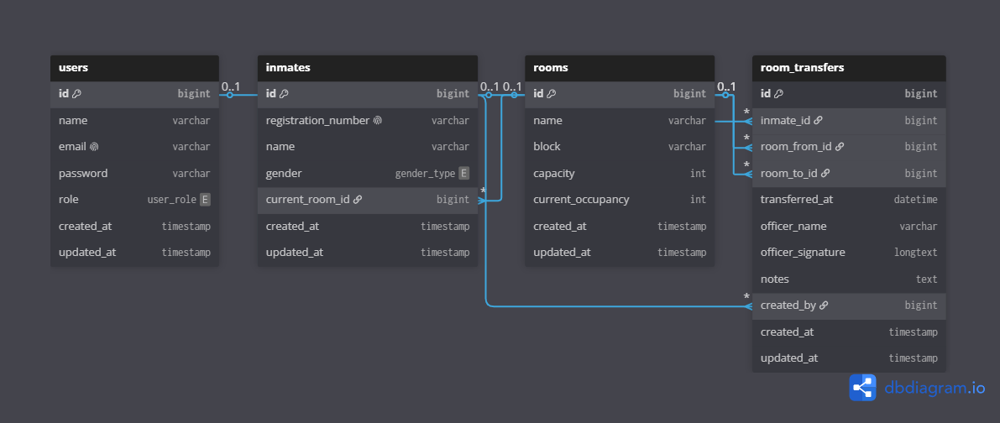

# SIMKAR

**English** | [Bahasa Indonesia](README.id.md)

SIMKAR (**Room Transfer Information System**) is a web application for recording, managing, and monitoring room transfers of incarcerated residents (WBP). It replaces manual record-keeping with searchable transfer histories, room occupancy monitoring, and report exports.

## Key features

- Dashboard summarizing WBP records, rooms, occupancy, and recent transfers
- WBP record and room assignment management
- Room management with capacity monitoring
- Room transfer recording and history
- General and room-specific QR codes for faster transfer entry
- Report filtering by date, officer, and room
- PDF and Excel report exports
- Admin and Officer role-based access control
- Profile management and password changes

## Access control

| Feature                      | Admin | Officer |
| ---------------------------- | :---: | :-----: |
| Dashboard                    |  Yes  |   Yes   |
| View rooms and WBP records   |  Yes  |   Yes   |
| Manage rooms and WBP records |  Yes  |    No   |
| Create and view transfers    |  Yes  |   Yes   |
| View and export reports      |  Yes  |   Yes   |
| Manage users                 |  Yes  |    No   |

## Technology stack

- PHP 8.3+
- Laravel 13
- Livewire 4 and Blade
- Tailwind CSS 4
- Vite 8
- MySQL
- DomPDF, Laravel Excel, and Endroid QR Code

## Requirements

Make sure your development environment includes:

- PHP 8.3 or newer with the extensions required by Composer
- Composer
- Node.js and npm
- MySQL

## Installation

1. Clone the repository and enter its directory.
   ```bash
   git clone <repository-url> simkar
   cd simkar
   ```
2. Install the PHP dependencies and create the environment file.
   ```bash
   composer install
   cp .env.example .env
   php artisan key:generate
   ```
   On Windows PowerShell, use `Copy-Item .env.example .env` instead of `cp`.
3. Create a MySQL database, then update the following values in `.env`.
   ```dotenv
   APP_NAME=SIMKAR
   APP_URL=http://localhost:8000

   DB_CONNECTION=mysql
   DB_HOST=127.0.0.1
   DB_PORT=3306
   DB_DATABASE=simkar
   DB_USERNAME=root
   DB_PASSWORD=
   ```
4. Run the migrations and create the initial administrator account.
   ```bash
   php artisan migrate --seed
   ```
5. Install the frontend dependencies and build the assets.
   ```bash
   npm install
   npm run build
   ```
6. Start the application.
   ```bash
   composer run dev
   ```
   The application will be available at <http://localhost:8000>.

### Optional demo data

After running the main seeder, you can add sample officers, rooms, WBP records, and transfer history:

```bash
php artisan db:seed --class=DevSeeder
```

Do not run `DevSeeder` in production because it creates sample data.

## Initial account

The main seeder creates the following account for local installation:

| Email               | Password   | Role  |
| ------------------- | ---------- | ----- |
| `admin@simkar.test` | `password` | Admin |

Change this password immediately from the profile page, especially when the application is accessible from another network.

## Development commands

```bash
# Start the server, queue worker, log viewer, and Vite
composer run dev

# Run the complete test suite
composer test

# Format PHP code
./vendor/bin/pint

# Format Blade templates
npm run format

# Build production assets
npm run build
```

## Production deployment

For a production environment:

```bash
composer install --no-dev --optimize-autoloader
npm install --ignore-scripts
npm run build
php artisan migrate --force
php artisan optimize
```

Set `APP_ENV=production`, `APP_DEBUG=false`, and `APP_URL` to the deployed domain. Configure the web server document root to use the `public` directory, and ensure that `storage` and `bootstrap/cache` are writable by the web server process. Run a queue worker when `QUEUE_CONNECTION` is not set to `sync`.

## Documentation

- [Product Requirements Document — English](docs/SIMKAR-PRD-EN.md)
- [Product Requirements Document — Indonesian](docs/SIMKAR-PRD-ID.md)
- [Page list — English](docs/SIMKAR-Pages-EN.md)
- [Page list — Indonesian](docs/SIMKAR-Pages-ID.md)

## Database diagram

[](docs/db/dbdiagram.png)

## Project structure

```text
app/Livewire/          Page components and interface logic
app/Models/            Application data models
database/migrations/  Database table definitions
database/seeders/     Initial account and demo data seeders
resources/views/      Blade templates
routes/web.php         Application routes
tests/                 Unit and feature tests
```

## License

This project is distributed under the MIT License, as declared in `composer.json`.
